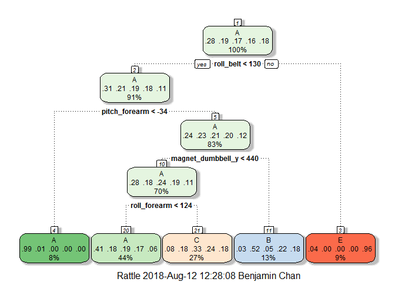

## Background
Using devices such as Jawbone Up, Nike FuelBand, and Fitbit it is now possible to collect a large amount of data about personal activity relatively inexpensively. These type of devices are part of the quantified self movement - a group of enthusiasts who take measurements about themselves regularly to improve their health, to find patterns in their behavior, or because they are tech geeks. One thing that people regularly do is quantify how much of a particular activity they do, but they rarely quantify how well they do it. In this project, your goal will be to use data from accelerometers on the belt, forearm, arm, and dumbell of 6 participants. They were asked to perform barbell lifts correctly and incorrectly in 5 different ways. More information is available from the website here: http://web.archive.org/web/20161224072740/http:/groupware.les.inf.puc-rio.br/har (see the section on the Weight Lifting Exercise Dataset).

## Packages

```r
library(caret)
library(rattle)
```

## Load data

```r
trainUrl <- "https://d396qusza40orc.cloudfront.net/predmachlearn/pml-training.csv"
testUrl <- "https://d396qusza40orc.cloudfront.net/predmachlearn/pml-testing.csv"

trainData <- read.csv(trainUrl, na.strings = c("NA", "#DIV/0!", ""))
testData <- read.csv(testUrl, na.strings = c("NA", "#DIV/0!", ""))

dim(trainData)
```

```
## [1] 19622   160
```

```r
dim(testData)
```

```
## [1]  20 160
```

The raw training data have 19622 rows and 160 columns while the raw testing data have 20 rows and 160 columns.

## Clean data
Remove the first 7 variables, which are not useful for prediction. Also remove variables with more than 90% NA.

```r
trainclean <- trainData[, -c(1:7)]
testclean <- testData[, -c(1:7)]

selectcol <- colMeans(is.na(trainclean))<0.9
trainclean = trainclean[, selectcol]
testclean = testclean[, selectcol]

dim(trainclean)
```

```
## [1] 19622    53
```

```r
dim(testclean)
```

```
## [1] 20 53
```

The clean training data have 53 columns while the clean testing data have 53 columns.

## Split data
To estimate out of sample error, we split clean training data into 2 portions. Set seed to ensure reproducibility.

```r
set.seed(12345)
inTrain <- createDataPartition(trainclean$classe, p = 0.7, list = F)
trainclean1 <- trainclean[inTrain, ]
trainclean2 <- trainclean[-inTrain, ]

dim(trainclean1)
```

```
## [1] 13737    53
```

```r
dim(trainclean2)
```

```
## [1] 5885   53
```

## Build models
Use 5-fold cross validation for training.

### Use classification tree

```r
trControl <- trainControl(method = "cv", number = 5)
model_CT <- train(classe~., data = trainclean1, method = "rpart", trControl = trControl)
fancyRpartPlot(model_CT$finalModel)
```

<!-- -->

```r
predict_train_CT <- predict(model_CT, trainclean2)
conf_train_CT <- confusionMatrix(trainclean2$classe, predict_train_CT)
accuracy_train_CT <- conf_train_CT$overall[1]
accuracy_train_CT
```

```
##  Accuracy 
## 0.4963466
```

The accuracy is 49.6% and hence the out of sample error is 49.6% using classification tree.

### Use random forests

```r
model_RF <- train(classe~., data = trainclean1, method = "rf", trControl = trControl)
print(model_RF)
```

```
## Random Forest 
## 
## 13737 samples
##    52 predictor
##     5 classes: 'A', 'B', 'C', 'D', 'E' 
## 
## No pre-processing
## Resampling: Cross-Validated (5 fold) 
## Summary of sample sizes: 10989, 10990, 10990, 10989, 10990 
## Resampling results across tuning parameters:
## 
##   mtry  Accuracy   Kappa    
##    2    0.9917742  0.9895937
##   27    0.9909734  0.9885812
##   52    0.9860961  0.9824117
## 
## Accuracy was used to select the optimal model using the largest value.
## The final value used for the model was mtry = 2.
```

```r
predict_train_RF <- predict(model_RF, trainclean2)
conf_train_RF <- confusionMatrix(trainclean2$classe, predict_train_RF)
accuracy_train_RF <- conf_train_RF$overall[1]
accuracy_train_RF
```

```
##  Accuracy 
## 0.9886151
```

The accuracy is 98.9% and hence the out of sample error is 98.9% using random forests.

### Use gradient boosting

```r
model_GBM <- train(classe~., data = trainclean1, method = "gbm", trControl = trControl, verbose = FALSE)
print(model_GBM)
```

```
## Stochastic Gradient Boosting 
## 
## 13737 samples
##    52 predictor
##     5 classes: 'A', 'B', 'C', 'D', 'E' 
## 
## No pre-processing
## Resampling: Cross-Validated (5 fold) 
## Summary of sample sizes: 10990, 10989, 10988, 10990, 10991 
## Resampling results across tuning parameters:
## 
##   interaction.depth  n.trees  Accuracy   Kappa    
##   1                   50      0.7569334  0.6917125
##   1                  100      0.8241253  0.7773848
##   1                  150      0.8568123  0.8188032
##   2                   50      0.8566658  0.8183658
##   2                  100      0.9063854  0.8815112
##   2                  150      0.9323002  0.9143297
##   3                   50      0.8981594  0.8710576
##   3                  100      0.9419819  0.9265826
##   3                  150      0.9611996  0.9509080
## 
## Tuning parameter 'shrinkage' was held constant at a value of 0.1
## 
## Tuning parameter 'n.minobsinnode' was held constant at a value of 10
## Accuracy was used to select the optimal model using the largest value.
## The final values used for the model were n.trees = 150,
##  interaction.depth = 3, shrinkage = 0.1 and n.minobsinnode = 10.
```

```r
predict_train_GBM <- predict(model_GBM, trainclean2)
conf_train_GBM <- confusionMatrix(trainclean2$classe, predict_train_GBM)
accuracy_train_GBM <- conf_train_GBM$overall[1]
accuracy_train_GBM
```

```
##  Accuracy 
## 0.9593883
```

The accuracy is 95.9% and hence the out of sample error is 95.9% using random forests.

## Conclusion
In this application, random forests model gives the highest accuracy. Finally use random forests to predict the testing data.

```r
predict_test <- predict(model_RF, testclean)
predict_test
```

```
##  [1] B A B A A E D B A A B C B A E E A B B B
## Levels: A B C D E
```
